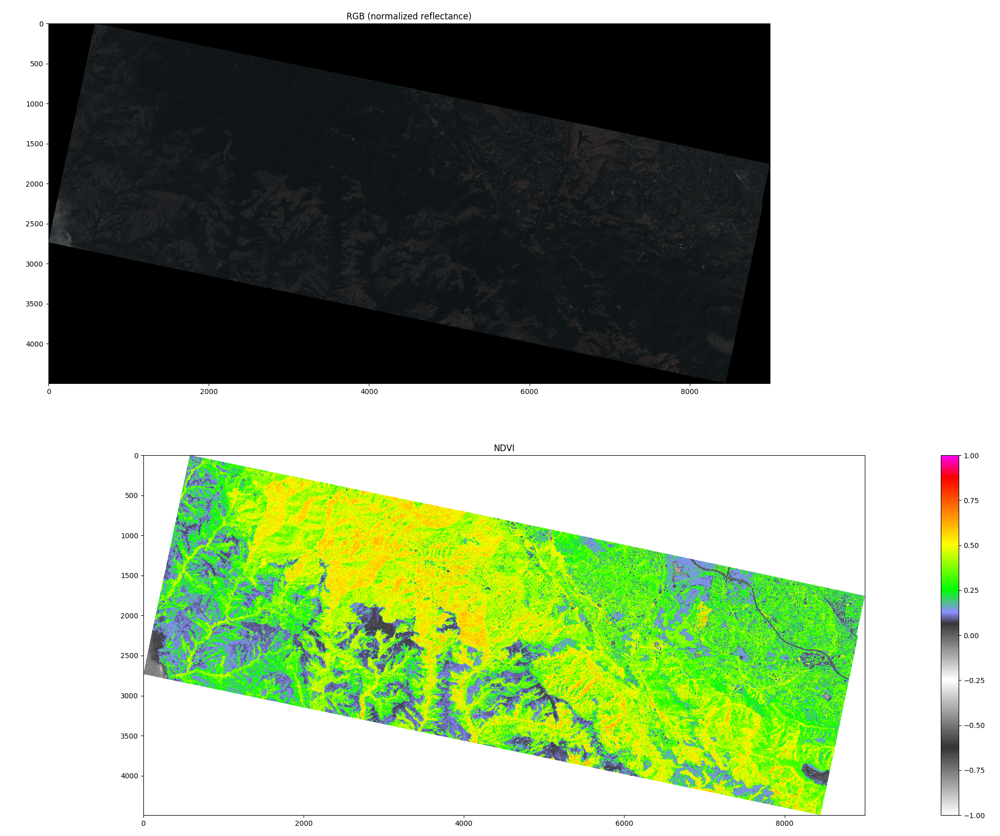

# Computing NDVI with Python

Return [normalized difference vegetation index (NDVI)](https://developers.planet.com/tutorials/calculate-ndvi/) for an image.

## Vegevision

`vegevision.py` is a set of tools for calculating and displaying NDVI from two images.
The functions assume that a "red" image is a grayscale image of the response to light between 0.4 to 0.7 micron,
and "near-infrared" is a grayscale image of the response to light between 0.7 to 1.1 micron.
Images are assumed to be in `float32` format (values between 0 and 1).

### Using Vegevision

```python
import numpy as np
import vegevision

blue, green, red, nir = np.split(imageWith4Bands)
ndvi = vegevision.get_ndvi(red,nir)
```

### Future plans for Vegevision

- Add examples for camera inputs (webcams or Raspberry Pi cameras)
- File saving with colormap
- Custom colormaps for NDVI (see: [NDVI_VGYRM-lut.csv](NDVI_VGYRM-lut.csv) as developed by [cfastie](https://publiclab.org/notes/cfastie/08-26-2014/new-ndvi-colormap))

The idea behind this repository is to build a set of tools with `vegevision.py` which can be run with different image sources and produce consistent results.
In the following example, Vegevision is applied to images from Planet's constellation.

## Planet NDVI

PlanetScope data collected by Dove satellites can be requested through the Planet API as `.tif` images.
The images have 4 bands: blue, green, red, and near-infrared, and also come with coefficients to normalize "top of atmosphere reflectance" so that images from two different times can be compared.

### Using Planet NDVI

Download assets of the type `analytic` and `analytic_xml` from `PSScene4Band`. Save the assets in a folder called `images/`.

This example uses the image id `20170928_181142_1032`.

```python
planet_ndvi.py
```

This returns the following plot.



### Future plans for Planet NDVI

- Automatically download images from Planet API if they are not found locally.
- Plot images of the same region from different times to observe how NDVI changes with seasons.
- Save NDVI plots as an animation.

---

## Intuitions behind NDVI

NDVI leverages the fact that chlorophyll in plants strongly reflects green light and near-infrared light.
Further, healthier plants have more chlorophyll and denser vegetation has more leaves, and thus
more surface area to reflect this light.
Thus NDVI is used to measure the amount of photosynthetic activity in an area.

### The NDVI equation

NDVI is defined as `NDVI = (NIR - RED) / (NIR + RED)`
where RED is reflected light between 0.4 to 0.7 micron and NIR is reflected light between 0.7 to 1.1 micron. [[1]](citation!)

The numerator "punishes" areas that strongly reflect visible red light and _not_ near-infrared light.

The denominator represents the total amount of reflected light in both of these bands.
By dividing by this total, the NDVI value is normalized to values between
-1 and 1.

```text
NIR = 0 -> (0-RED)/(0+RED) = -RED/RED = -1
RED = 0 -> (NIR-0)/(NIR+0) =  NIR/NIR =  1
```

By normalizing this difference to the total reflected light in both of those bands,
the NDVI value in areas of dense and healthy vegetation is much higher against the background.
Note that NDVI is an _index_ and thus a unitless quantity.

The colormap can influence how NDVI is interpreted by humans, and this topic is [discussed at length by user `cfastie` on PublicLab.org](https://publiclab.org/notes/cfastie/08-26-2014/new-ndvi-colormap).
This repository includes the colormap discussed in this article.

### A closer look at near-infrared imagers

Near-infrared, also called near-IR or NIR, is a region of the electromagnetic spectrum just beyond the human visual range, 700nm to 1200nm or so.
When working with near-infrared imaging, it is common practice to speak in terms of micron, though different industries may use other units like nanometers or wave-number. When speaking about visible light, it is common to speak in nanometers.

Modern imaging sensors today are CMOS detectors, or arrays of tiny circuits on silicon semiconductors.
The semiconductor circuits exploit the property of silicon called a bandgap.
Without going too far into the weeds, we can think of photons as little packets of energy.
The amount of energy a photon carries is described by its wavelength.
Electrons in the silicon jump around when they are hit with photons of certain energies, and these energies are described by the bandgap.
The detector circuits gather up the electrons that jumped around,
and by counting up the number of electrons we can measure the amount of light
that hit the detector.
The silicon CMOS detectors in most cameras today are sensitive to photons between 400nm all the way up to 1100nm.
The CMOS imaging sensors alone will collect electrons when hit by any photons in this range, or "band".

Detectors only count the number of electrons regardless of the wavelength of photon that caused it to jump.
In order to keep track of color, there are tiny filters placed in front of certain pixels on the array.
This way, some pixels only allow blue light to hit the silicon, for example, and so the sensor is able to keep track of the number of electrons, or signal, from blue light at that position on the array.
Red, green, and blue filters are groups together in grids, where each unit cell has
filters for all three channels.
However, the material used for red filters usually allows red _and_ near-infrared light to pass through.
To block the extra unwanted near-infrared light, most cameras have an extra filter in front of the camera that blocks out light above 700nm, which is beyond the human visual range.
For NDVI, by removing the near-infrared filter on common camera sensors, we can measure the near-IR and visible signal.

One common application of detecting near-infrared light is for nightvision.
However, these cameras are not so different from any old webcam or consumer camera.
In most cases, the only difference is that nightvision cameras do not have an infrared filter!
It is common for nightvision cameras to be paired with infrared lamps or LEDs, but this has nothing to do with the detector itself.
During the day, the sun provides plenty of light over the whole band to reflect off of objects and be picked up by the detector.
At night, a light source is needed in order for light to reflect off of the scene and back into the detector.
A regular lamp does this just fine!
Infrared light sources are used at night since they are out of the human visual range (dark places still look dark to the naked eye) but the infrared light still reflects off of the environment and back into the camera.
The camera, which is sensitive to near-infrared light, collects electrons that were hit by the infrared photons.
For NDVI, the sun is our visible and infrared light source, and provides plenty of light across the whole band to be reflected into the camera.

When thinking about near-infrared, it is important not to confuse it with "thermal" infrared imaging.
Recalling the [blackbody curve](link!), objects at ambient temperature (roughly 300K)
emit thermal radiation at wavelengths in the "mid-wave infrared" (2 to 5 micron) or
the "long-wave infrared" (5 to 20 micron).
Thermal imagers detect these longer wavelengths, but detectors used for visible and near-infrared light don't.
